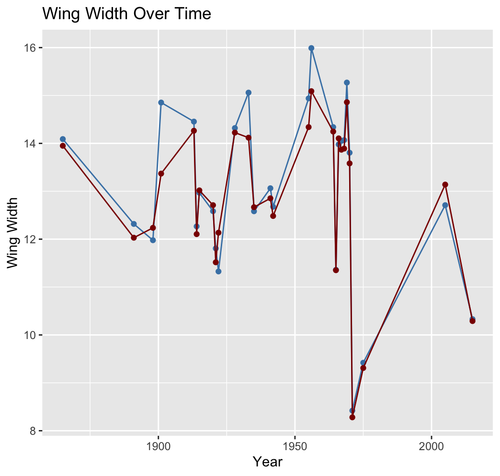
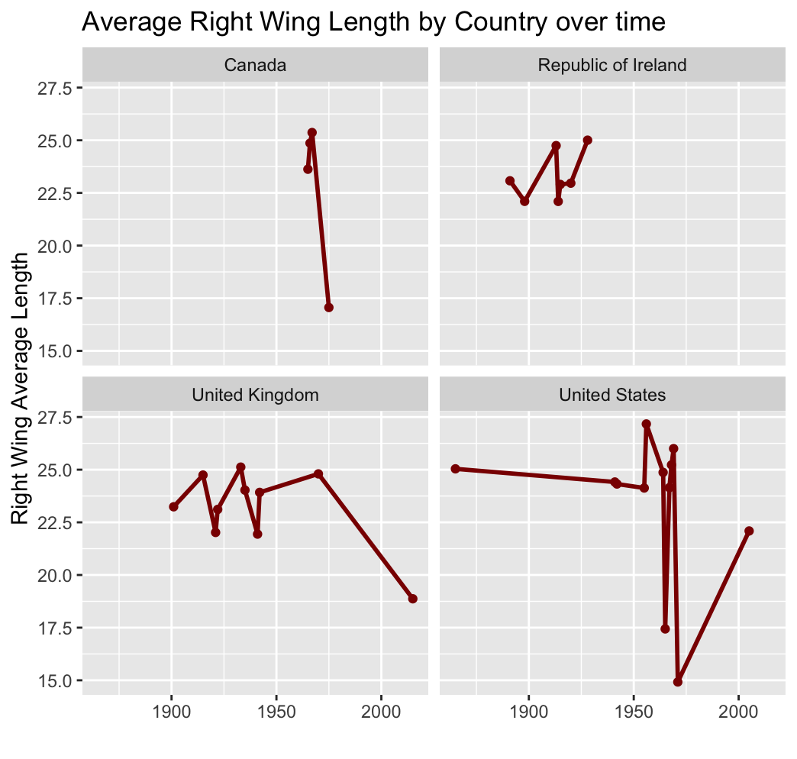

# DATA 332 Final Project - Augustana College
## Authors: Kate Martino, Nicole Nguyen, Tran Bui, Claire Weeks

# Cabbage Butterfly Data
### Introduction 
We recieved this data from the Augustana College Biology department. This data has to do with the Cabbage Butterfly and differnt attributes regarding the butterfly that were collected over the years 1865 and 2015. We took this data and made a variety of visualizations and calculations to better undertsand the data and practice our newly learned skills in R.

### Data Cleaning Process 
We were sure to keep the integrety of the raw and clean data files we were provided by making the data tidy in using R. Some of the things we did clean the data in R. We renamed the the columns that had spaces in them so they were easy to use. We renames the column names that had a special charcter in them. We also fixed a variety of string inconsitencies to ensure we were able to use all of the data in each column. Next, we used a left join to combine the clean data and the raw and selected the spesific columns that we wanted to use to make our final data frame.

## Visualization #1 
Purpose of this Visual: We chose a line graph so we can see the change over time when it comes to the average wing width. The multiple lines allows us to compare both the right wing and the left wing on the same plane. It is interesting to see how this specific aspect of the Cabbage butterfly's anatomy has changed from 1865 to 2015. This information could be valuable when it comes to forecasting what the butterfly's wing width may be in the future. It also makes us wonder/ want to dive deeper in regards to what is causing the peaks and valleys in the data. 

## Visualization #2
Prupose of this Visual: This visual is helpful in examining how the wing length of the cabbage butterfly differs between various countries. It can be seen in this visual that over time all four countries collected in the data have varying average length for both the right wing and the left wing. It also shows us that some countries only have data collected from certain years. Byusing the facet wrap function we can easily compare the countries to one another in a single visual. 

### Right Wing Length

### Left Wing Length

## Visualization #3
Purpose of this visual: This visual is helpful in examining how the wing length of the cabbage butterfly differs between various countries. It can be seen in this visual that over time all four countries collected in the data have varying average length for both the right wing and the left wing. It also shows us that some countries only have data collected from certain years. Byusing the facet wrap function we can easily compare the countries to one another in a single visual. 

### Left Wing

### Right Wing

## T-Test
We performed a paired t-test for the left and right data. We found that the p-value was 0.1769 and that the true difference in means is not equal to zero meaning the data has a high correlation.

## Mean, Median, Max, Min
In this section you will see a variety of visualizations that show the descriptive statistics of the Cabbage Butterfly data. We preformed calculations and visualized this data by splitting the data into two groups, the left and right data. By doing this we were able to look at each of the variables in those groups and analyze their correlation. The first visualization you will see is a stacked line graph showing the median apex, length, and width of the left and right data over time. You can see that both the left and right wing data are very similar when it comes to the peaks and valleys represented on the graph. The next graph is a scatter plot showing the correlation between the right and left data. This correlation is positive and very strong because as you can tell from, the visualization it is very linear. This makes a lot of sense because the two variables being looked at are the left and right side of the cabbage butterfly and a butterfly is symmetrical. Lastly, the boxplot visual shows the descriptive statistics for the data in a different manner. Here we can draw a similar conclusion regarding the symmetry of butterfly.  

# Ladybug Data
### Introduction
We received this data from the Biology Department at Augustana College. This specific data set is a collection of ladybug data that the department found in the summer months of 2021. The data includes fields such as species, collector, family, genus, coordinates, and date. With this data out group chose to prepare a variety of visualizations to provide insights regarding the ladybug collection project.

### Data Cleaning Process
For this data set specifically the main data cleaning process we had to preform was cleaning the sting inconsistencies in the data to ensure we could preform accurate calculations. In the ladybug data we cleaned the Species and Collector columns. To do this we used the function Str_replace to identify the incorrect string and match it with one consistent sting for that column for each value. While this was rather time consuming it was the dynamic way to clean the data so if more data were to get added with the same error it can be cleaned with the click of a button. For the sake of our project, we also decided to drop all the NULL values in our data set to make out visualizations and calculations clearer. 

## Visualization #1
Purpose of this Visualization: The purpose of this visualization is to show the distribution of ladybug collection by each person. Here you can see that all four collectors collected around the same amount but O. Ruffatto collected the most by about 7 ladybugs. 
  

## Visualization #2
Purpose of Visualization: The purpose of this visualization is to show the overall distribution of what species were collected at the highest frequency. We can see that the Harmonia axyridis was most collected at 179 and the Colemegilla Maculata was not far behind at  a count of 128. 

## Visualization #3
Purpose of Visualization: The purpose of this visualization is to see which collector collected what specific species. As you can see the overall distribution of species among collector is pretty equal. It can bee seen that M. Gorsegnerand O.Ruffatto collected a larger amount of ladybugs in general. 

## Visualization #4
Purpose of Visualization: The purpose of this visualization is to see the distribution of the overall amount of ladybugs collected each day. We can see that they were collected in increments of three days over three months time. This graph also showsus that over the months from June to August the volume of ladybugs collected increased. 

## Median, Max, Min
Due to the high amounts of categorical data we had in the lady bug data set we chose to take the Mean, Median, Mix, and Max of the date column to see how many ladybug were collected during each day. We found that on June 17th, 2021 there were the smallest number of lady bugs collected. On August 3rd 2021 the highest numbr of lady bugs were collected. Lastly, we. found that on August 4th, 2021 was the median for number of ladybugs collected. To do this we used base R to calculate the Max, Min, and Median number. We stored this information in a table to look at. 

## Chi Squared Test
This data set had a high volume of categorical data, so we decided to perform a Chi Squared test to look for a correlation between different variables in the data set. We looked at the combination of Collector and Species in addition to Coordinates and Species. A p-value is a statistical measurement used to validate a hypothesis against observed data. A p-value measures the probability of obtaining the observed results, assuming that the null hypothesis is true. The lower the p-value, the greater the statistical significance of the observed difference. For the first combination of data, we got a p-value of 0.01499 and the second we got a p-value of 0.0004988. This shows the relation among Coordinates and Species is statistically significant due to the lower p-value.
